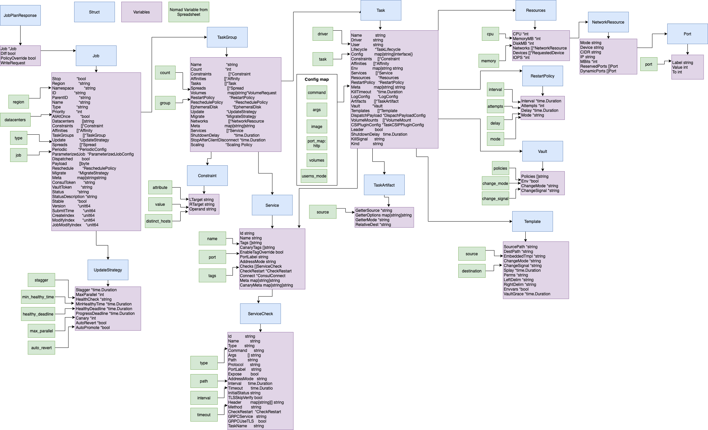

Deploying apps
==============

In order to deploy an app into an environment using dp-deployer an accompanying .yml file is needed. The .yml files to be used are the manifests in [dp-configs](https://github.com/ONSdigital/dp-configs/tree/master/manifests)

Full Example .yml
------------

The following example contains every variable that would end up in the .yml for an app to be deployed.

```yml
---
name: <app-name>
repo_uri: <url for app>
type: nomad-job

nomad:
  java: true
  service: 
    - name: healthcheck
      enabled: true
      path: /healthcheck
  groups:
    - class: web
      userns_mode: true
      volumes: "/var/babbage/site:/content:ro"
      distinct_hosts: true
      mount: true
      profiles:
        development:
          count: 2
          resources:
            cpu: 500
            memory: 1024
          command_line_args: []
        production:
          count: 2
          resources:
            cpu: 8000
            memory: 2816
          command_line_args: []
    groups:
    - class: publishing
      userns_mode: true
      volumes: "/var/babbage/site:/content:ro"
      distinct_hosts: true
      mount: false
      profiles:
        development:
          count: 2
          resources:
            cpu: 500
            memory: 1024
          command_line_args: []
        production:
          count: 2
          resources:
            cpu: 8000
            memory: 2816
          command_line_args: []
```

Small Example .yml
------------------

The following example is a .yml file that contains mostly the defaults for all variables.
```yml
---
name: <app-name>
repo_uri: <url for app>
type: nomad-job

nomad:
  go: true
  groups:
    - class: publishing
      profiles:
        development:
          count: 2
          resources:
            cpu: 100
            memory: 256
        production:
          count: 2
          resources:
            cpu: 100
            memory: 256
 ```

Default Values
--------------

The Full Example above is an example of all the variables that should go into the .yml file. The variable should only be included in the .yml if it differs from the default.

It's also important to state whether the app is a Java or a Golang app by using the variables `java` or `go` and set to true. See example above for a Java example and Golang will be the same.

| Variable | Default Value | Description |
|----------|---------------| -------------|
| enabled  | true          | Does the app have a healthcheck?|
| path     | "/health"       | Path for the healthcheck |
| usersns_mode| false | |
| volumes  |  |
| distinct_hosts| false | |
| mount |  | Does the app use a mount eg. web-mount  |
| command_line_args | [ "./&lt;app-name&gt;" ] | What are the args used by nomad to run the app? |

Nomad Mappings
--------------

All variables used in the .yml file and within the Nomad package wthin dp-deployer all map to Nomad variables. The image below shows all of these mappings.



To update the diagram:
1. Go to [Google Drive](https://drive.google.com/drive/folders/1K_5TqHQhFL7Spw64X3iBXbhM1Le8__U1) and select Nomad Structs and Varables
2. Update the diagram 
3. Export as an image
4. Copy the image into the repo with the same file name and commit

